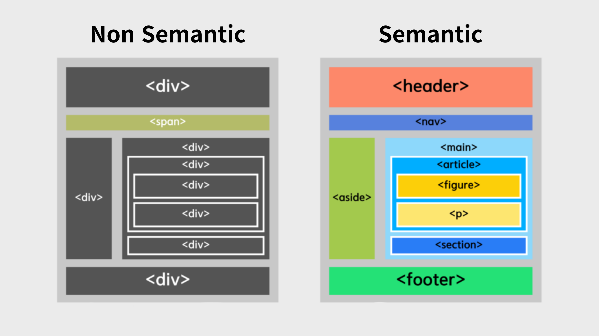

# 시맨틱 태그(Semantic Tag)

**Semantic**은 '의미의' 또는 '의미론적인'이라는 뜻을 가진 단어이다. 따라서 **시맨틱 태그**(Semantic Tag)는 '의미를 가진 태그'라는 의미가 된다.

## 사용 이유

시맨틱 태그(Semantic Tag)를 사용하는 이유는 다음과 같다.

### 1. 검색 엔진 최적화 (Search Engine Optimization, SEO)

검색 엔진은 태그를 기반으로 우선순위를 정하며, Google과 같은 검색 엔진에서 이를 활용한다. 시맨틱 태그(Semantic Tag)를 사용하면 검색 엔진과 사용자 모두 웹 페이지를 더 쉽게 인식할 수 있다. 또한, 시맨틱 태그(Semantic Tag)는 관련 키워드와 문구로 웹 페이지를 최적화하는 데 도움을 주어, 검색 결과에서 더 높은 순위를 차지하고 더 많은 트래픽을 유도할 수 있다.

### 2. 접근성 향상

시맨틱 태그(Semantic Tag)는 사람들이 웹 페이지를 탐색하고 상호작용하는 데 큰 도움을 준다. 화면 판독기, 키보드, 음성 명령과 같은 보조 기술에 유용한 정보와 단서를 제공할 수 있다. 예를 들어, `<nav>` 태그는 해당 영역에 링크가 포함되어 있음을 나타내고, `<article>` 태그는 독립적인 콘텐츠가 포함되어 있음을 알려준다.

### 3. 가독성 향상

시맨틱 태그(Semantic Tag)는 콘텐츠의 명확하고 일관된 흐름과 구조를 만드는 데 도움을 준다. 또한, 제목, 키워드, 요약 등 콘텐츠에서 가장 중요하고 관련성이 높은 부분을 강조하는 데에도 유용하다.

## 종류

주로로 사용되는 시맨틱 태그(Semantic Tag)는 다음과 같다.

- `<header>`: 문서의 머릿글을 정의하며, 로고, 내비게이션, 제목 및 기타 소개 정보를 포함하는 페이지의 상단 영역을 나타낸다.

- `<nav>`: 웹 페이지의 메뉴, 탭, 탐색 경로 등 탐색 링크가 포함된 영역을 정의한다.

- `<main>`: 웹 페이지의 주요 콘텐츠를 담는 태그로, 본문이나 핵심 내용을 나타낸다. `<main>` 태그는 문서에서 단 하나만 사용해야 한다.

- `<article>`: 독립적인 글이나 콘텐츠를 정의하는 데 사용되며, 블로그 게시물, 뉴스 기사, 제품 리뷰 등 독립적으로 재사용할 수 있는 콘텐츠를 나타낸다.

- `<figure>`: 일러스트레이션, 다이어그램, 사진, 코드 블록 등과 같은 독립적인 콘텐츠를 나타낼 때 사용된다.

- `<section>`: 문서 내의 특정 주제나 부제목과 관련된 콘텐츠 그룹을 정의하는 태그로, 기본 콘텐츠의 부분을 나타낸다.

- `<aside>`: 페이지의 주요 콘텐츠를 제외한 부가적인 콘텐츠를 담는 태그로, 주로 사이드바와 같은 옆에 위치하는 내용을 정의하는 데 사용된다.

- `<footer>`: 문서의 바닥글을 정의하며, 페이지 하단에 위치한다. `<footer>`는 일반적으로 연락처 정보, 사이트 맵, 추가 링크, 소셜 미디어 사이트에 대한 링크 등 웹 사이트를 하나로 묶고 SEO를 강화하는 데 도움이 되는 콘텐츠를 포함한다.

## 사용 예시

