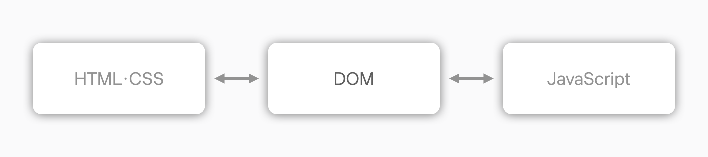
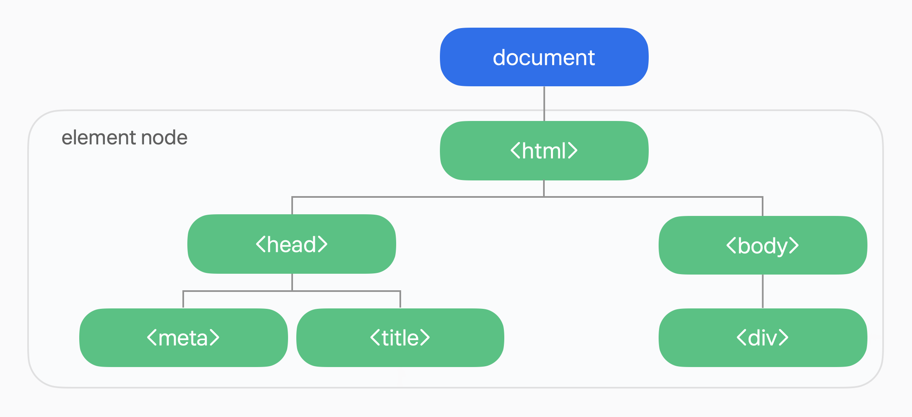

# 문서 객체 모델(DOM)

문서 객체 모델(DOM)은 HTML 문서 구조를 객체 형태로 표현한 것이다. 영어로는 Document Object Model이라고 하지만, 보통 약어인 DOM으로 표기된다. 한국어로도 '돔'이라고 불린다.

## 문서 구조

HTML 문서는 `<body>`, `
`, `
` 등 여러 태그로 구성되어 있으며, 이러한 태그들이 문서의 구조를 이루고 있다. 이러한 HTML 요소들의 계층을 반영하여 만들어진 객체가 바로 DOM이다.

HTML 문서를 객체로 표현하면, JavaScript와 같은 스크립트 언어나 프로그래밍 언어들이 웹 페이지의 내용을 동적으로 제어하거나 수정할 수 있게 된다. 즉, DOM은 HTML로 구성된 웹 페이지와 스크립트 및 프로그래밍 언어들을 연결하는 역할을 한다. 이를 통해 JavaScript는 DOM을 사용하여 웹 페이지의 요소들을 접근하고, 수정하며, 이벤트를 처리할 수 있다.

## DOM의 계층 구조

DOM은 HTML 문서의 구조를 계층적으로 표현한 객체이다. DOM의 계층은 트리 구조로 이루어지며, 트리 구조는 하나의 최상위 노드(Node)에서 여러 자식 노드들이 뻗어나가는 형태로 구성된다.

아래 사진과 같이 `document` 노드가 트리 구조의 최상위에 위치하며, 그 아래로 `<html>`, `<head>`, `<body>` 등의 노드가 계층적으로 연결되어 있는 것을 볼 수 있다.

