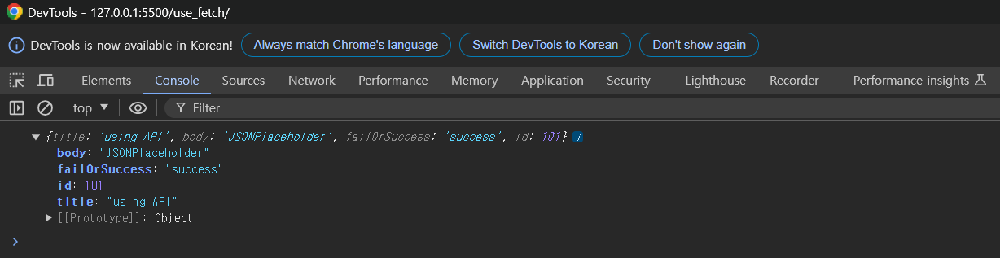

# Fetch

Fetch API는 HTTP 파이프라인을 구성하는 요청과 응답 등의 요소를 JavaScript에서 접근하고 조작할 수 있는 인터페이스를 제공한다.<br>
또한 Fetch API가 제공하는 fetch() 메서드로 네트워크의 리소스를 쉽게 비동기적으로 취득할 수도 있다.

> 기본적인 형태
>
> ```javascript
> fetch("주소")
>   .then((response) => {
>     return response.json(); // JSON 응답을 파싱
>   })
>   .then((data) => {
>     console.log(data); // 파싱된 데이터 사용
>   });
> ```
>
> 또는
>
> ```javascript
> async function logJSONData() {
>   const response = await fetch("주소");
>   const jsonData = await response.json();
>   console.log(jsonData);
> }
> ```

## 요청 옵션들

### GET (데이터 조회)

fetch() 함수는 디폴트로 GET 방식으로 작동하고 GET 방식은 요청 전문을 받지 않기 때문에 옵션 인자가 필요가 없다.

```javascript
fetch("주소")
  .then((response) => response.json())
  .then((json) => console.log(json));
```

응답이 이루어지면 응답받은 결과는 then() 함수의 인수로 전달 받는다.

### POST (데이터 생성)

```javascript
fetch("주소", {
  method: "POST",
  body: JSON.stringify({
	전달할 json 데이터
  }),
  headers: {
	헤더 값
  }
})
.then((response) => response.json())
.then((json) => console.log(json));
```

method에는 HTTP 요청 방법을 기록한다.

### PUT (데이터 수정)

````javascript
fetch("주소/:id", {
  method: "POST",
  body: JSON.stringify({
	변경할 json 데이터
  }),
  headers: {
	헤더 값
  }
})
.then((response) => response.json())
.then((json) => console.log(json));```
````

POST와 유사하지만 주소/:id에서 특정 id의 값을 바꿔야하기 때문에 id를 입력하지 않으면 오류가 발생한다.

### DELETE (데이터 삭제)

```javascript
fetch("주소/:id", {
  method: "POST",
});
```

## 활용 예시 (JSONPlaceholder)

```javascript
fetch("https://jsonplaceholder.typicode.com/posts/", {
  method: "POST",
  body: JSON.stringify({
    title: "using API",
    body: "JSONPlaceholder",
    failOrSuccess: "success",
  }),
  headers: {
    "Content-type": "application/json; charset=UTF-8",
  },
})
  .then((response) => response.json())
  .then((json) => {
    console.log(json);
  });
```

결과

