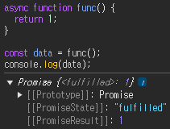

# async/await

`async`와 `await`는 **ES2017**(ECMAScript 2017)부터 도입된 JavaScript의 비동기 처리 방식 중 하나다. 이 두 키워드를 사용하면 비동기 코드를 동기 코드처럼 작성할 수 있어, 가독성이 높아지고 에러 처리가 간편해진다.

## async

`async` 키워드는 `await`을 사용하기 위한 선언문으로 이해하면 쉽다.
`function` 앞에 `async`를 붙이면, 함수 내부에서 `await` 키워드를 사용할 수 있게 되며, "이 함수는 비동기 함수이며, 항상 `Promise`를 반환한다"는 선언과 같다.

### 코드

```js
// await 사용 예시
async function getData(url) {
  const res = await fetch(url); // 요청이 완료될 때까지 기다림
  const data = await res.json(); // 응답 데이터를 JSON으로 파싱
  return data;
}
```

```js
// async 함수의 기본 동작
async function simpleFunc() {
  return 1; // Promise를 반환
}

const data = func();
console.log(data); // Promise 객체 출력
```



## await

`await` 키워드는 비동기 처리 결과를 보다 간단하게 얻을 수 있도록 도와주는 문법이다. 이름에서 알 수 있듯이, `await`은 비동기 작업이 완료될 때까지 코드 실행을 잠시 멈추고 기다린다. 이를 통해 `then()`을 복잡하게 연결하지 않아도, 비동기 함수 앞에 `await`을 붙이는 것만으로 결과를 간단하게 처리할 수 있다.

### 코드

```js
// 기존 then()을 사용하는 방식
fetch(url)
  .then((res) => res.json()) // 응답을 JSON으로 변환
  .then((data) => console.log(data)); // 변환된 데이터를 출력
```

```js
// async/await를 사용하는 방식
async function fetchData() {
  const res = await fetch(url); // 요청을 보내고 응답을 기다림
  const data = await res.json(); // 응답을 JSON으로 변환
  console.log(data); // 데이터를 출력
}

fetchData();
```

## 차이점

`async` 함수는 내부적으로 `Promise`를 반환하므로 `then()`을 사용할 수 있다. 하지만 `async`와 `await`이 도입된 이후, `then()`을 사용하는 방식은 권장되지 않는다. `async/await`만으로도 동일한 작업을 더 간단하고 직관적으로 수행할 수 있기 때문이다.
