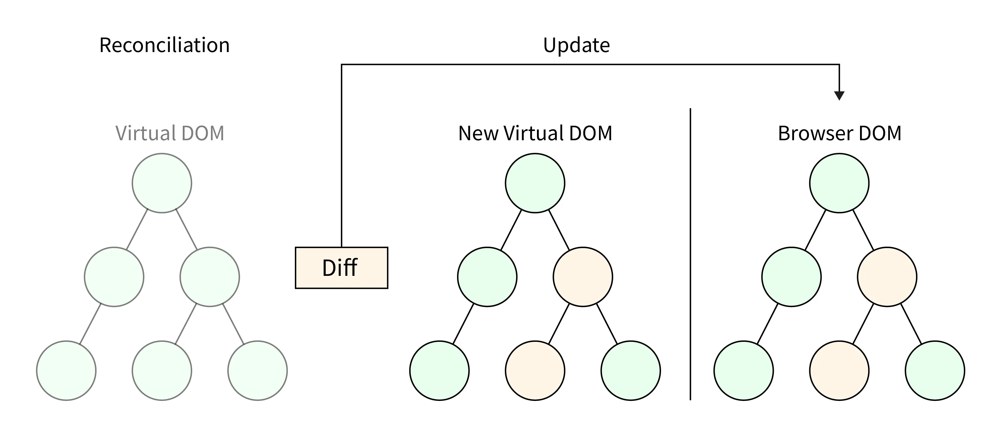

# 가상 DOM(Virtual DOM)

React가 많은 개발자들에게 사랑받는 이유 중 하나는 높은 성능과 빠른 속도이다. React가 뛰어난 성능을 보여줄 수 있는 비결 중 하나는 바로 **가상 DOM**(Virtual DOM)이다.

가상 DOM은 React의 핵심 개념 중 하나로, 보다 효율적으로 변경된 부분만 찾아내어 브라우저에 빠르게 렌더링할 수 있도록 돕는다.

## DOM의 문제점

기존 DOM에는 아래와 같은 단점들이 존재한다.

- 새로운 변경 사항이 발생할 때마다 페이지 전체를 리렌더링한다. 이는 변경된 요소만 업데이트하면 되는 경우에도 불필요하게 모든 노드를 다시 처리하게 되는 문제를 일으킨다.

- 매번 페이지 전체를 리렌더링하기 때문에, DOM 트리의 노드 수가 많아질수록 렌더링 속도가 눈에 띄게 느려진다. 특히 대규모 웹 애플리케이션에서는 이로 인해 성능 문제가 발생할 가능성이 크다.

## 동작 원리

위와 같은 문제를 해결하기 위해 React는 가상 DOM을 사용한다. React는 렌더링이 필요한 상황이 발생하면, 새로운 화면에 들어갈 내용이 담긴 가상 DOM을 생성한다.

가상 DOM은 실제 DOM의 가벼운 복사본으로, 메모리 상에 존재하며 JavaScript 객체 형태로 관리된다. React는 항상 렌더링 이전의 가상 DOM과 렌더링 이후의 가상 DOM을 비교한다. 이를 diffing 알고리즘으로 처리하며, 변경된 부분만 실제 DOM에 반영한다.

이 과정은 아래와 같이 이루어진다.

1. diffing 알고리즘을 사용하여 이전 가상 DOM과 새 가상 DOM을 비교

2. 변경된 부분을 찾은 후, 해당 부분만 실제 DOM에 업데이트

3. 최소한의 DOM 조작을 통해 렌더링 성능을 최적화

React의 diffing 알고리즘은 효율적이고 빠르게 변경 사항을 감지할 수 있도록 설계되었으며, 이를 통해 복잡한 UI에서도 높은 성능을 유지할 수 있다.
