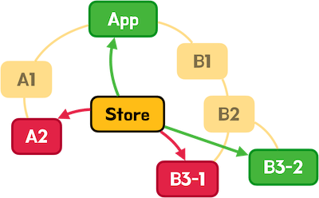

# Zustand

**Zustand**는 React 애플리케이션에서 상태 관리를 단순하고 효율적으로 처리할 수 있도록 도와주는 가벼운 상태 관리 라이브러리이다.

## Store

**Store**는 Zustand에서 상태를 관리하는 방법으로, React 애플리케이션에서 여러 데이터를 중앙에서 효율적으로 관리하도록 돕는다. 이를 통해 상태를 여러 컴포넌트에서 쉽게 공유할 수 있으며, 상태 변경 시 해당 상태를 사용하는 컴포넌트만 리렌더링되도록 설계되어 있다.



## Context API와 Zustand의 차이점

Context API는 Provider로 감싸진 컴포넌트 계층 내에서만 데이터를 공유할 수 있다. 컴포넌트 트리 구조에 의존적이며, Prop Drilling 문제가 발생할 수 있다.

Zustand는 컴포넌트 트리와 독립적으로 상태를 전역적으로 관리할 수 있다. 상태 변경 시 필요한 컴포넌트만 리렌더링되며, 성능 최적화가 용이하다.

## 사용

Zustand 사용 순서

1. **Store 생성**: `create` 함수를 사용하여 상태를 관리할 Store를 생성한다.

2. **set과 get 함수 사용**: `create`의 콜백 함수에서 `set`과 `get`을 사용하여 상태를 변경하거나 조회한다.

   - **`set`**: 상태를 변경하는 함수.
   - **`get`**: 현재 상태를 조회하는 함수.

3. **State와 Action**:

   - **State**(상태): `create` 함수의 콜백에서 반환하는 객체의 속성으로, 현재 상태를 나타낸다.
   - **Action**(액션): 상태를 변경하는 동작을 정의하는 메소드이다.

4. **Hook 형태로 사용**: `create`로 만든 Store는 `useStoreName`과 같은 Hook 형태로 컴포넌트에서 사용할 수 있게 된다.

## 코드

### 상태와 액션 정의

기본적인 방식

```jsx
import { create } from "zustand";

export const useCountStore = create((set, get) => ({
  count: 0,
  increment: () => {
    const { count } = get();
    set({ count: count + 1 });
  },
  decrement: () => {
    const { count } = get();
    set({ count: count - 1 });
  },
}));
```

간결한 방식 (간단히 상태 변경)

```jsx
import { create } from "zustand";

export const useCountStore = create((set) => ({
  count: 0,
  increment: () => set((state) => ({ count: state.count + 1 })),
  decrement: () => set((state) => ({ count: state.count - 1 })),
}));
```

### 상태 사용

```jsx
import { useCountStore } from "./store/count";

function App() {
  const { count, increment, decrement } = useCountStore();

  return (
    <div>
      <h1>{count}</h1>
      <button onClick={increment}>증가</button>
      <button onClick={decrement}>감소</button>
    </div>
  );
}

export default App;
```
